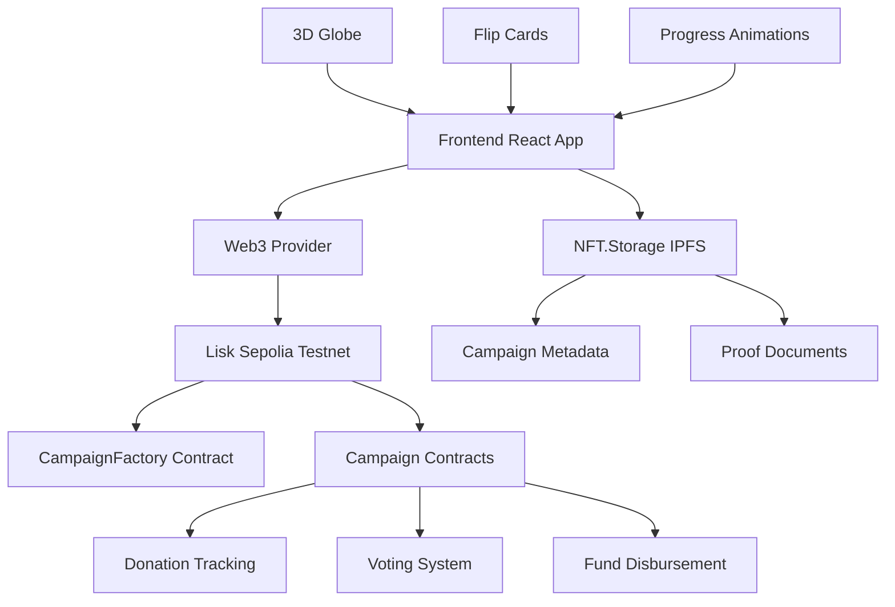

# PeduliChain - Transparent Charity on Blockchain


PeduliChain is a revolutionary blockchain-based charity platform that ensures complete transparency, community governance, and immutable proof of impact for charitable campaigns.

## 🌟 Features

### 🔗 Blockchain Transparency
- All donations and fund usage recorded on Lisk Sepolia testnet
- Immutable proof of transactions and impact
- Smart contract-based fund management

### 🗳️ Community Governance
- Donor voting on fund disbursement proposals
- 48-hour voting periods with simple majority rule
- Minimum 3 votes required for proposal execution

### 🌍 Interactive 3D Experience
- Interactive 3D globe showing global campaign locations
- Flip card campaign previews with hover effects
- Liquid progress bars with real-time updates
- Mobile-responsive with touch gestures

### 💰 Multi-Token Support
- **USDC Sepolia**: `0x181D675e1d7958Aa0034A45fDeE619Fd345Fa71A`
- **Wrapped LSK**: `0x00Bb2C36F94B46a903C663e996dF21ef7b804`
- Native ETH donations

### 📁 Decentralized Storage
- Campaign metadata stored on NFT.Storage (IPFS)
- Proof documents for disbursement proposals
- API Key: `285a98d9.55d85615b85a4d958c1ecd65e5cd10a8`

## 🏗️ Architecture



## 🚀 Quick Start

### Prerequisites
- Node.js v18+ and npm
- MetaMask or compatible Web3 wallet
- Git

### Installation

```bash
# Clone the repository
git clone <YOUR_REPO_URL>
cd pedulichain

# Install dependencies
npm install

# Install Hardhat dependencies
npm install --save-dev hardhat @nomicfoundation/hardhat-toolbox

# Set up environment variables
cp .env.example .env
# Edit .env with your private key and API keys
```

### Environment Variables

```bash
# .env
PRIVATE_KEY=your_private_key_here
NFT_STORAGE_KEY=285a98d9.55d85615b85a4d958c1ecd65e5cd10a8
ETHERSCAN_API_KEY=your_blockscout_api_key
```

### Development

```bash
# Start the development server
npm run dev

# In another terminal, compile contracts
npx hardhat compile

# Run tests
npx hardhat test

# Deploy to Lisk Sepolia
npx hardhat run scripts/deploy.cjs --network liskSepolia
```

## 📱 Usage Flows

### Creating a Campaign
1. Connect your wallet (MetaMask recommended)
2. Click "Create Campaign" 
3. Fill in campaign details:
   - Title and description
   - Funding goal in ETH
   - Campaign deadline
   - Category selection
   - Upload cover image
4. Review and deploy to blockchain
5. Share your campaign with supporters

### Donating to Campaigns
1. Browse campaigns on the interactive globe or list
2. Click on a campaign card to view details
3. Enter donation amount in ETH
4. Confirm transaction in your wallet
5. Track your donation on the blockchain

### Voting on Fund Usage
1. Campaign coordinators propose fund disbursements
2. Donors receive voting rights proportional to their contributions
3. Vote "For" or "Against" proposals within 48-hour windows
4. Proposals with majority approval automatically execute
5. All voting is transparent and recorded on-chain

## 🧪 Testing

### Smart Contract Tests
```bash
# Run comprehensive test suite
npx hardhat test

# Test specific components
npx hardhat test test/CampaignFactory.test.js
npx hardhat test test/Campaign.test.js
```

### Frontend Tests
```bash
# Run Jest unit tests
npm test

# Run Cypress E2E tests
npm run test:e2e
```

### Test Coverage
- ✅ Campaign creation and validation
- ✅ Donation handling and tracking
- ✅ Voting mechanism and thresholds
- ✅ Fund disbursement automation
- ✅ Edge cases and security scenarios

## 📋 Smart Contracts

### CampaignFactory.sol
- **Purpose**: Factory pattern for creating new campaigns
- **Key Functions**:
  - `createCampaign()` - Deploy new campaign contracts
  - `getCampaignsByCoordinator()` - List campaigns by creator
  - `getAllCampaigns()` - Get all active campaigns

### Campaign.sol
- **Purpose**: Individual campaign logic and fund management
- **Key Functions**:
  - `donate()` - Accept donations with automatic tracking
  - `proposeDisbursement()` - Coordinator proposes fund usage
  - `voteDisbursement()` - Donors vote on proposals
  - Auto-execution when majority approval reached

### Security Features
- **Access Control**: Role-based permissions (coordinator vs donors)
- **Validation**: Input sanitization and balance checks
- **Reentrancy Protection**: Safe external calls
- **Time Locks**: Voting periods and deadlines

## 🌐 Deployment

### Automated CI/CD with GitHub Actions

```yaml
# .github/workflows/deploy.yml
name: Deploy PeduliChain
on:
  push:
    branches: [main]

jobs:
  test-and-deploy:
    runs-on: ubuntu-latest
    steps:
      - uses: actions/checkout@v3
      - name: Setup Node.js
        uses: actions/setup-node@v3
        with:
          node-version: '18'
      
      - name: Install dependencies
        run: npm ci
      
      - name: Run tests
        run: npm test
      
      - name: Deploy contracts
        run: npx hardhat run scripts/deploy.js --network liskSepolia
        env:
          PRIVATE_KEY: ${{ secrets.PRIVATE_KEY }}
      
      - name: Build frontend
        run: npm run build
      
      - name: Deploy to Vercel
        uses: vercel/action@v1
        with:
          vercel-token: ${{ secrets.VERCEL_TOKEN }}
```

### Manual Deployment

```bash
# Deploy contracts
npx hardhat run scripts/deploy.cjs --network liskSepolia

# Build and deploy frontend
npm run build
vercel deploy
```

## 🔧 Technical Stack

### Frontend
- **React 18** with TypeScript
- **Vite** for fast development
- **Tailwind CSS** with custom design system
- **React Three Fiber** for 3D components
- **Framer Motion** for animations
- **Wagmi** for Web3 integration

### Blockchain
- **Solidity ^0.8.0** smart contracts
- **Hardhat** development environment
- **Lisk Sepolia** testnet deployment
- **Ethers.js** for blockchain interaction

### Storage & Infrastructure
- **NFT.Storage** for decentralized metadata
- **IPFS** for document storage
- **Vercel** for frontend hosting
- **GitHub Actions** for CI/CD

## 🛡️ Security Considerations

### Smart Contract Security
- **Audited Patterns**: Following OpenZeppelin standards
- **Access Controls**: Role-based permissions
- **Input Validation**: Comprehensive parameter checking
- **Reentrancy Guards**: Protection against attacks
- **Time Locks**: Voting periods and deadlines

### Frontend Security
- **Input Sanitization**: All user inputs validated
- **Wallet Integration**: Secure Web3 connection handling
- **Error Handling**: Graceful failure management
- **HTTPS Only**: Secure communication protocols

## 🤝 Contributing

We welcome contributions to PeduliChain! Please follow these steps:

1. Fork the repository
2. Create a feature branch: `git checkout -b feature/amazing-feature`
3. Make your changes and add tests
4. Run the test suite: `npm test`
5. Commit your changes: `git commit -m 'Add amazing feature'`
6. Push to the branch: `git push origin feature/amazing-feature`
7. Open a Pull Request

### Development Guidelines
- Write comprehensive tests for new features
- Follow the existing code style and conventions
- Update documentation for any API changes
- Ensure all tests pass before submitting PR

## 📄 License

This project is licensed under the MIT License - see the [LICENSE](LICENSE) file for details.

## 🙏 Acknowledgments

- **Lisk Foundation** for blockchain infrastructure
- **NFT.Storage** for decentralized storage
- **OpenZeppelin** for security patterns
- **Three.js Community** for 3D capabilities
- **React and Tailwind** teams for excellent tooling

## 📞 Support

- **Discord**: [Join our community](https://discord.gg/pedulichain)
- **Email**: support@pedulichain.org
- **Documentation**: [docs.pedulichain.org](https://docs.pedulichain.org)
- **Bug Reports**: [GitHub Issues](https://github.com/pedulichain/issues)

---

**Built with ❤️ for transparent charity and social impact**

*Making every donation count, every vote matter, and every impact visible.*